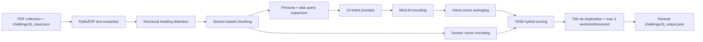

# Adobe India Hackathon 2025 - Round 1B

This project is a persona-driven document retrieval system for Challenge 1B. Given a user persona, a job-to-be-done, and a collection of PDFs, it extracts section-level chunks, ranks the most relevant sections, and writes a structured JSON answer for each collection.

The system is intentionally lightweight: it uses PyMuPDF for PDF parsing, `all-MiniLM-L6-v2` for sentence embeddings, and a 70/30 hybrid score that combines semantic similarity with keyword overlap.

## Real Example Output

Input from `Collection 1/challenge1b_input.json`:

```json
{
  "persona": {
    "role": "Academic Researcher"
  },
  "job_to_be_done": {
    "task": "Write a literature review on sustainable urban transport in European cities."
  },
  "documents": [
    { "filename": "Final-version-Public-Transport-Declaration-Barcelona-FINAL.pdf" },
    { "filename": "SUMP_state-of-the-art_of_report.pdf" },
    { "filename": "sump_guidelines_2019_interactive_document_1.pdf" },
    { "filename": "UITP-EU-Political-priorities.pdf" }
  ]
}
```

Ranked output produced by the system:

```json
{
  "extracted_sections": [
    {
      "document": "sump_guidelines_2019_interactive_document_1.pdf",
      "section_title": "Urban Mobility Plans",
      "importance_rank": 1,
      "page_number": 10,
      "relevance_score": 0.6199
    },
    {
      "document": "Final-version-Public-Transport-Declaration-Barcelona-FINAL.pdf",
      "section_title": "We, the representatives of major European cities and public transport organisations, have",
      "importance_rank": 2,
      "page_number": 2,
      "relevance_score": 0.5894
    },
    {
      "document": "Final-version-Public-Transport-Declaration-Barcelona-FINAL.pdf",
      "section_title": "On the supply industry to further  develop innovation in public transport",
      "importance_rank": 3,
      "page_number": 4,
      "relevance_score": 0.5869
    },
    {
      "document": "sump_guidelines_2019_interactive_document_1.pdf",
      "section_title": "European learning programme for cities",
      "importance_rank": 4,
      "page_number": 163,
      "relevance_score": 0.5743
    },
    {
      "document": "UITP-EU-Political-priorities.pdf",
      "section_title": "FOR THE LEGISLATIVE TERM 2024-2029",
      "importance_rank": 5,
      "page_number": 1,
      "relevance_score": 0.523
    }
  ]
}
```

Example retrieved evidence for rank 1:

```text
Sustainable Urban Mobility Planning is Europe's de facto urban transport planning concept.
The Urban Mobility Package advocates "a step-change in the approach to urban mobility..."
```

## Quantitative Evaluation

Manual relevance labels were defined for the three provided collection queries. Precision@5 measures how many of the top five retrieved sections are relevant; Recall@5 measures how many manually labeled relevant sections were retrieved.

Run:

```bash
python scripts/evaluate_retrieval.py
```

Stored-output results:

| Collection | Precision@5 | Recall@5 | Hits |
| --- | --- | --- | --- |
| Collection 1 | 1.00 | 1.00 | 5 |
| Collection 2 | 1.00 | 1.00 | 5 |
| Collection 3 | 0.40 | 1.00 | 2 |

Collection 3 is intentionally kept as a useful failure signal: the system retrieves two relevant syllabus/navigation sections, but also ranks administrative sections such as reading lists and eligibility because they contain certification/syllabus vocabulary.

## Scoring Ablation

The retrieval score is:

```text
score = semantic_weight * cosine_similarity(intent_vector, section_vector)
      + keyword_weight * keyword_overlap(section_text, persona_and_task_terms)
```

Run:

```bash
python scripts/evaluate_retrieval.py
```

Measured ablation across the three sample queries:

| Scoring variant | Mean Precision@5 | Mean Recall@5 | Relevant hits |
| --- | --- | --- | --- |
| keyword 0/100 | 0.60 | 0.80 | 9 |
| balanced 50/50 | 0.73 | 0.93 | 11 |
| hybrid 70/30 | 0.80 | 1.00 | 12 |
| semantic-heavy 90/10 | 0.60 | 0.80 | 9 |
| semantic 100/0 | 0.53 | 0.73 | 8 |

On this labeled set, the 70/30 hybrid improves Mean Precision@5 by 33% relative to pure keyword scoring and by 51% relative to pure semantic scoring.

## Latency and Memory Benchmarks

Run:

```bash
python scripts/benchmark.py
```

Local benchmark, with MiniLM loaded once and reused across collections:

| Collection | PDFs | Pages | Processing time | Peak RSS |
| --- | --- | --- | --- | --- |
| Collection 1 | 4 | 232 | 5.04s | 649 MB |
| Collection 2 | 3 | 30 | 1.32s | 678 MB |
| Collection 3 | 3 | 108 | 1.39s | 720 MB |

Model load time in the benchmark run was 0.27s. All measured collections stayed under 10 seconds and under 1 GB peak resident memory.

## Pipeline Architecture



## Approach

### 1. Structural Analysis and Chunking

The system parses each PDF with PyMuPDF, detects heading-like text using font size, boldness, position, and simple heading heuristics, then treats the text under each heading as a chunk. This keeps retrieval results tied to meaningful section titles instead of arbitrary fixed-size windows.

### 2. Dynamic Query Generation

The raw persona and task are expanded into ten intent prompts. Each prompt is embedded with `all-MiniLM-L6-v2`, and the vectors are averaged into one intent vector. This captures multiple phrasings of the user's information need.

### 3. Hybrid Relevance Scoring

Each section gets both a semantic score and a keyword-overlap score. The default 70/30 blend performed best in the ablation above, so it is used as the default.

### 4. Intelligent Curation

After ranking, the system removes near-duplicate section titles and limits each document to at most two returned sections. This makes the final JSON more diverse across the document collection.

## Failure Case Analysis

1. Scanned PDFs without a text layer can produce empty or very sparse output because PyMuPDF text extraction does not perform OCR.
2. Heading detection can mistake administrative text for a meaningful section heading. Collection 3 shows this: "Recommended Reading List" ranks highly even though it is not a learning-objective section.
3. Very broad personas or tasks can reduce precision because many sections share generic vocabulary. The keyword component helps, but it can also over-boost repeated terms such as "syllabus" or "certification."
4. The original sample folders used `pdf/` while the code expected `PDFs/`; the pipeline now accepts both names.

## How to Build and Run

### Prerequisites

Docker must be installed and running.

### Build

From the repository root:

```bash
docker build --platform linux/amd64 -t adobe-hackathon-1b -f Challenge_1b/Dockerfile .
```

The Dockerfile downloads `all-MiniLM-L6-v2` during image build and sets runtime offline mode, so the container does not need network access when processing PDFs.

### Run

```bash
docker run --rm -v "$(pwd)/Challenge_1b:/app" adobe-hackathon-1b
```

The script automatically finds `Collection */challenge1b_input.json` files and writes `challenge1b_output.json` into each collection folder.

### Optional scoring weights

```bash
SEMANTIC_WEIGHT=0.5 KEYWORD_WEIGHT=0.5 docker run --rm -v "$(pwd)/Challenge_1b:/app" adobe-hackathon-1b
SEMANTIC_WEIGHT=1.0 KEYWORD_WEIGHT=0.0 docker run --rm -v "$(pwd)/Challenge_1b:/app" adobe-hackathon-1b
SEMANTIC_WEIGHT=0.0 KEYWORD_WEIGHT=1.0 docker run --rm -v "$(pwd)/Challenge_1b:/app" adobe-hackathon-1b
```

## Libraries and Model

- PyMuPDF: PDF parsing and text extraction
- sentence-transformers: sentence embedding framework
- PyTorch: embedding backend
- all-MiniLM-L6-v2: compact sentence-transformer model used for semantic retrieval
